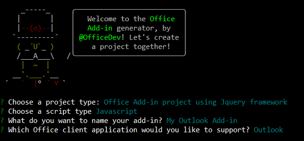
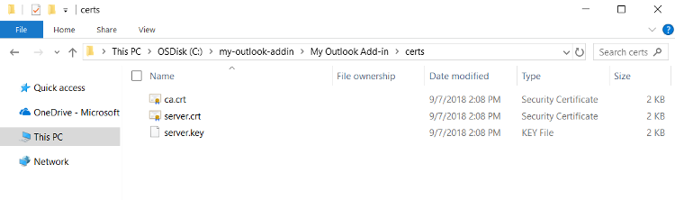
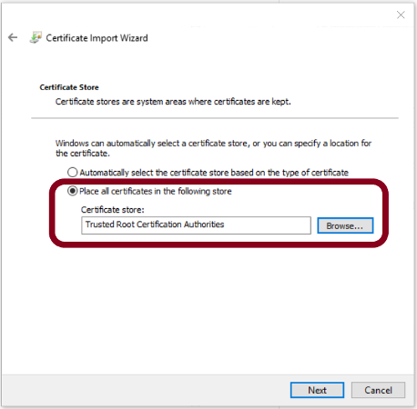
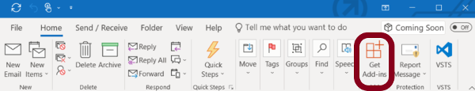

# Build an Outlook add-in with Office JavaScript APIs

Outlook add-ins are web applications built using standard web technologies and loaded within the Outlook client. In this lab, you'll use Outlook JavaScript APIs to build an event-driven add-in that can be used to validate room availabilty and capacity when creating an appointment.

In this lab:

- [Create the add-in project](#create-the-add-in-project)
- [Update the code](#update-the-code)
- [Prepare to test your add-in](#prepare-to-test-your-add-in)
- [Try it out](#try-it-out)

## Create the add-in project

Complete the following steps to create the add-in project by using the **Yeoman generator for Office Add-ins**.

1. Use either File Explorer or the command prompt to create a folder on your local drive, and name the folder `my-outlook-addin`. This is where you'll create the add-in project.

1. Open a command prompt and navigate to your new folder. For example, if you created the `my-outlook-addin` folder at the root of `C:\`, run the following command from the command prompt to navigate to that folder.

    ```
    cd C:\my-outlook-addin
    ```

1. Use the **Yeoman generator for Office Add-ins** to create an Outlook Add-in project by running the following command from the command prompt. Answer the prompts as shown below:

    ```
    yo office
    ```

    - **Choose a project type:** `Office Add-in project using Jquery framework`
    - **Choose a script type:** `JavaScript`
    - **What do you want to name your add-in?:** `My Outlook Add-in`
    - **Which Office client application would you like to support?:** `Outlook`
    
    
    
    After you complete the wizard, the generator will create the project and install supporting Node components.

## Update the code

At this point, the **Yeoman generator for Office Add-ins** has created a very basic add-in project that you can use as a starting point for building your Outlook add-in. Update the code as described in this section to customize the functionality of your add-in.

### Step 1: Customize the manifest file

The manifest file defines the add-in's settings and capabilities. 

1. Open the file **my-outlook-add-in-manifest.xml**.

1. Replace the entire contents of the file with the following XML markup and save the file. Notice the following things about this markup:

    - The `Rule` element specifies the activation rule that should be evaluated for this contextual add-in. In this case, the specified rule evaluates to `true` for an `Appointment` item.

    - The `ExtensionPoint` element defines the button on the ribbon that will open the add-in's task pane. In this case, the button will appear on the ribbon only for an appointment organizer.

    ```xml
    <?xml version="1.0" encoding="UTF-8"?>
    <OfficeApp
            xmlns="http://schemas.microsoft.com/office/appforoffice/1.1"
            xmlns:xsi="http://www.w3.org/2001/XMLSchema-instance"
            xmlns:bt="http://schemas.microsoft.com/office/officeappbasictypes/1.0"
            xmlns:mailappor="http://schemas.microsoft.com/office/mailappversionoverrides/1.0"
            xsi:type="MailApp">

    <!-- Begin Basic Settings -->

    <Id>bac018a4-efdb-494b-aa48-dd7c9eec25c4</Id>
    <Version>1.0.0.0</Version>
    <ProviderName>Jane Doe</ProviderName>
    <DefaultLocale>en-US</DefaultLocale>
    <DisplayName DefaultValue="My Outlook Add-in" />
    <Description DefaultValue="Room Validator"/>
    <IconUrl DefaultValue="https://localhost:3000/assets/icon-32.png" />
    <HighResolutionIconUrl DefaultValue="https://localhost:3000/assets/hi-res-icon.png"/>
    <SupportUrl DefaultValue="https://localhost:3000" />

    <Hosts>
        <Host Name="Mailbox" />
    </Hosts>
    <Requirements>
        <Sets>
        <Set Name="Mailbox" MinVersion="1.1" />
        </Sets>
    </Requirements>
    <FormSettings>
        <Form xsi:type="ItemRead">
        <DesktopSettings>
            <SourceLocation DefaultValue="https://localhost:3000/index.html"/>
            <RequestedHeight>250</RequestedHeight>
        </DesktopSettings>
        </Form>
    </FormSettings>

    <Permissions>ReadWriteItem</Permissions>

    <!-- Rule: ItemType = Appointment -->
    <Rule xsi:type="RuleCollection" Mode="Or">
        <Rule xsi:type="ItemIs" ItemType="Appointment" FormType="Edit"/>
    </Rule>

    <DisableEntityHighlighting>false</DisableEntityHighlighting>

    <VersionOverrides xmlns="http://schemas.microsoft.com/office/mailappversionoverrides" xsi:type="VersionOverridesV1_0">
        <Requirements>
        <bt:Sets DefaultMinVersion="1.3">
            <bt:Set Name="Mailbox" />
        </bt:Sets>
        </Requirements>
        <Hosts>
        <Host xsi:type="MailHost">

            <DesktopFormFactor>
                <FunctionFile resid="functionFile" />

                <!-- Button for Appointment Organizer -->
                <ExtensionPoint xsi:type="AppointmentOrganizerCommandSurface">
                    <OfficeTab id="TabDefault">
                        <Group id="apptComposeGroup">
                            <Label resid="groupLabel" />
                            <Control xsi:type="Button" id="apptComposeOpenPaneButton">
                            <Label resid="apptComposeButtonLabel" />
                            <Supertip>
                                <Title resid="apptComposeSuperTipTitle" />
                                <Description resid="apptComposeSuperTipDescription" />
                            </Supertip>
                            <Icon>
                                <bt:Image size="16" resid="icon16" />
                                <bt:Image size="32" resid="icon32" />
                                <bt:Image size="80" resid="icon80" />
                            </Icon>
                            <Action xsi:type="ShowTaskpane">
                                <SourceLocation resid="apptComposeTaskPaneUrl" />
                            </Action>
                            </Control>
                        </Group>
                    </OfficeTab>
                </ExtensionPoint>
            </DesktopFormFactor>
        </Host>
        </Hosts>

        <Resources>
        <bt:Images>
            <bt:Image id="icon16" DefaultValue="https://localhost:3000/assets/icon-16.png"/>
            <bt:Image id="icon32" DefaultValue="https://localhost:3000/assets/icon-32.png"/>
            <bt:Image id="icon80" DefaultValue="https://localhost:3000/assets/icon-80.png"/>
        </bt:Images>
        <bt:Urls>
            <bt:Url id="functionFile" DefaultValue="https://localhost:3000/function-file/function-file.html"/>
            <bt:Url id="apptComposeTaskPaneUrl" DefaultValue="https://localhost:3000/index.html"/>
        </bt:Urls>
        <bt:ShortStrings>
            <bt:String id="groupLabel" DefaultValue="My Add-in Group"/>
            <bt:String id="customTabLabel"  DefaultValue="My Add-in Tab"/>
            <bt:String id="apptComposeButtonLabel" DefaultValue="Room Validator"/>
            <bt:String id="apptComposeSuperTipTitle" DefaultValue="Validate the choice of meeting room"/>
        </bt:ShortStrings>
        <bt:LongStrings>
            <bt:String id="apptComposeSuperTipDescription" DefaultValue="Opens a pane which validates that the selected meeting room is available at the chosen time and can accommodate the number of invited attendees."/>
        </bt:LongStrings>
        </Resources>
    </VersionOverrides>
    </OfficeApp>
    ```

### Step 2: Customize the HTML

1. Open the file **index.html** to specify the HTML for the add-in. 

1. Replace the entire contents of the `body` tag with the following HTML markup, and save the file.

    ```html
    <body class="ms-font-m ms-welcome">
        <header class="ms-welcome__header ms-bgColor-themePrimary ms-u-fadeIn500">
            <h1 class="ms-fontSize-xxl ms-fontWeight-regular ms-fontColor-white">Room Validator</h1>
        </header>
        <main id="app-body" class="ms-welcome__main" style="display: none;">

            <div id="appointment-details">
                <h2 class="ms-font-l ms-fontWeight-semibold ms-fontColor-neutralPrimaryAlt ms-u-slideUpIn20">Appointment details</h2>
                <br />
                <p class="ms-font-m ms-fontColor-neutralSecondaryAlt"><span class="ms-fontWeight-semibold">Total number of attendees:&#160;</span><label id="attendees-count"></label></p>
                <p class="ms-font-m ms-fontColor-neutralSecondaryAlt"><span class="ms-fontWeight-semibold">Start time:&#160;</span><label id="start-time"></label></p>
                <p class="ms-font-m ms-fontColor-neutralSecondaryAlt"><span class="ms-fontWeight-semibold">End time:&#160;</span><label id="end-time"></label></p>
                <br />
            </div>

            <h2 class="ms-font-xl ms-fontWeight-semibold ms-fontColor-themeDark ms-u-slideUpIn20">Choose a room</h2>
            <br />
            <p class="ms-font-m">Choose a room from the list to see its capacity and availability. Press <b>Select</b> to specify the chosen room as the meeting location and see validation results.</p>
            <br />
            <select id="room" class="ms-font-m">
                <option value="0n">-- Choose a room --</option>
                <option value="2a">Conference Room Adams</option>
                <option value="2p">Conference Room Carter</option>
                <option value="4a">Conference Room Ford</option>
                <option value="4p">Conference Room Johnson</option>
                <option value="6a">Conference Room Lincoln</option>
                <option value="6p">Conference Room Reagan</option>
                <option value="8a">Conference Room Truman</option>
                <option value="8p">Conference Room Wilson</option>
            </select>
            <ul class="ms-List ms-welcome__features ms-u-slideUpIn10">
                <li class="ms-ListItem">
                    <i class="ms-Icon ms-Icon--People"></i>
                    <span class="ms-font-m ms-fontColor-neutralPrimary">Capacity:&#160;&#160;</span><label id="room-capacity"></label>
                </li>
                <li class="ms-ListItem">
                        <i class="ms-Icon ms-Icon--DateTime"></i>
                        <span class="ms-font-m ms-fontColor-neutralPrimary">Availability:&#160;&#160;</span><label id="room-availability"></label>
                    </li>
            </ul>
            <br />
            <button id="select" class="ms-Button ms-bgColor-themeDark">
                <span class="ms-fontColor-themeDark ms-fontWeight-semibold">Select</span>
            </button>
            <br />

            <h2 class="ms-font-xl ms-fontWeight-semibold ms-fontColor-themeDark ms-u-slideUpIn20">Validation results</h2>
            <br />
            <label id="result-message"></label>
            <ul id="result-list" class="ms-List ms-welcome__features ms-u-slideUpIn10"></ul>
        </main>

        <script type="text/javascript" src="node_modules/jquery/dist/jquery.js"></script>
        <script type="text/javascript" src="node_modules/office-ui-fabric-js/dist/js/fabric.js"></script>
    </body>
    ```

### Step 3: Customize the CSS

Open the file **app.css** to specify the custom styles for the add-in. Replace the entire contents of the file with the following code and save the file.

```css
html, body {
    width: 100%;
    height: 100%;
    margin: 0;
    padding: 0;
}

ul, p, h1, h2, h3, h4, h5, h6 {
    margin: 0;
    padding: 0;
}

.ms-welcome {
    position: relative;
    display: -webkit-flex;
    display: flex;
    -webkit-flex-direction: column;
    flex-direction: column;
    -webkit-flex-wrap: nowrap;
    flex-wrap: nowrap;
    min-height: 800px;
    min-width: 150px;
    overflow: auto;
    overflow-x: hidden;
}

.ms-welcome__header {
    min-height: 40px;
    padding: 10px;
    padding-bottom: 20px;
    display: -webkit-flex;
    display: flex;
    -webkit-flex-direction: column;
    flex-direction: column;
    -webkit-flex-wrap: nowrap;
    flex-wrap: nowrap;
    -webkit-align-items: center;
    align-items: center;
    -webkit-justify-content: flex-end;
    justify-content: flex-end;
}

.ms-welcome__header > h1 {
    margin-top: 10px;
    text-align: center;
}

.ms-welcome__main {
    display: -webkit-flex;
    display: flex;
    -webkit-flex-direction: column;
    flex-direction: column;
    -webkit-flex-wrap: nowrap;
    flex-wrap: nowrap;
    -webkit-align-items: center;
    align-items: left;
    -webkit-flex: 1 0 0;
    flex: 1 0 0;
    padding: 20px 20px;
}

.ms-welcome__main > h2 {
    width: 100%;
    text-align: left;
}

.ms-welcome__features.ms-List .ms-ListItem > .ms-Icon {
    font-size: 14pt;
}

.ms-welcome__features.ms-List .ms-ListItem > .ms-Icon {
    margin-right: 10px;
}

@media (min-width: 0) and (max-width: 350px) {
    .ms-welcome__features {
        width: 100%;
    }
}
```

Update the following styles:
- .ms-welcome
- .ms-welcome__header
- .ms-welcome__header > h1

### Step 4: Customize the script

Open the file **src\index.js** to specify the script for the add-in. 

1. Delete all initial content from **src\index.js**.

1. Add the following code at the top of the file to register event handlers for the `Office.EventType.AppointmentTimeChanged` event and the `Office.EventType.RecipientsChanged` event.

1. Save the file.

...

## Prepare to test your add-in

Before you can test your add-in in Outlook, you must complete the tasks described in this section. 

### Start the web server

1. Open a command prompt and navigate to the root directory of your project. For example, if you created the `my-outlook-addin` folder at the root of `C:\`, and named your add-in `My Outlook Add-in` when you [created your add-in project](#create-the-add-in-project) using the **Yeoman generator for Office Add-ins**, run the following command from the command prompt to navigate to the root directory of your project.

    ```
    cd C:\my-outlook-addin\My Outlook Add-in
    ```

1. At the command prompt in the root directory of your project, run the following command to start the application web server at `https://localhost:3000`.

    ```
    npm start
    ```

### Trust the local web server's certificate

Office clients require that add-ins come from a trusted and secure location. Before you can test your add-in locally within Outlook, you must configure your workstation to trust the local web server's self-signed certificate. To do this, complete the following steps:

1. In File Explorer, navigate to the `certs` folder within your add-in project. For example, if you created the `my-outlook-addin` folder at the root of `C:\` and named your add-in `My Outlook Add-in` when you [created your add-in project](#create-the-add-in-project) using the **Yeoman generator for Office Add-ins**, navigate to the `C:\my-outlook-addin\My Outlook Add-in\certs` folder in File Explorer.

    

1. Within the `certs` folder, double-click on the file `ca.crt`. In the **Certificate** dialog window that opens, press **Install Certificate**.

    

1. In the **Certificate Import Wizard** dialog window, choose **Local Machine** and press **Next**.

    

1. Select **Place all certificates in the following store** and then press **Browse**, select **Trusted Root Certification Authorities**, and press **OK**. Then press **Next** to advance to the final step of the certificate import process.

    

1. Press **Finish** to import the certificate.

    

### Sideload the add-in's manifest in Outlook

Now that your add-in application is running on a local web server and your workstation trusts the local web server's self-signed certificate, you can upload the add-in's manifest file to Outlook. The manifest file defines your add-in's settings and capabilities, providing Outlook with the information it requires to run your add-in.

1. Open Outlook and select **Get Add-ins** from the ribbon of the **Home** tab.

    

1. In the dialog window that opens, select **My add-ins**.

    

1. In the **Custom add-ins** section at the bottom of the dialog window, select **Add a custom add-in** and then choose **Add from file**.

    

1. In the **Choose File to Upload** dialog window, navigate to your project folder, select your add-in project's manifest file `my-outlook-add-in-manifest.xml`, and press **Open**. Accept all prompts during the installation.

    

## Try it out

1. Once you've sideloaded the manifest, open an appointment in a new window in Outlook.

1. On the **Appointment** tab , locate the add-in's **Display all properties** button.

    

1. Click the button to open the add-in's taskpane.

    

## Congratulations!

Congratulations, you've successfully created an Outlook add-in! To learn more about creating Outlook add-ins, checkout the Outlook add-ins developer documentation at [https://aka.ms/outlook-add-ins-docs](https://aka.ms/outlook-add-ins-docs).
